# Lidl BakeMate Python Terminal Application

[Image source](https://www.lidl.co.uk/our-products/bakery)

Program live link - [Heroku](https://pp3-lidl-bake-mate.herokuapp.com/)

Accompanying spreadsheet - [Google Sheets](https://docs.google.com/spreadsheets/d/1F5qGL73_mbY4tX07SAwo8x-ooswImLdlVWjapZWEyjg/edit#gid=1612631949)

Right/Middle click to open links in a new tab.

The table of contents can be accessed at any time by selecting the list icon
 next to `README.md` at the top-left of the page.

---

## Overview

Lidl BakeMate is a data-driven Python program with Google Sheets integration
 that aims to boost productivity in Lidl GB stores. The program requests input
 from the user which is used to perform calculations which increase efficiency
 in a daily task. Data is presented in an accessible format to the user in the
 terminal, as well as in the integrated worksheet. 

### Usage Scenario

Lidl prides itself on its in-store bakery offering. Goods are baked three times
 per day (twice on a Sunday), according to the bake plan for the day - which is
 unique to the store. Both morning bakes are produced as laid out on the plan.
 However, the third and final bake of the day works differently. Bakery
 co-ordinators jot down their current stock levels for each line at 14:00. From
 there, they will subtract their stock on hand from the final stock required
 column on their paper worksheet. After they have manually written down this
 sum, they will then proceed to bake the goods needed in the calculated
 quantities.

As efficiency is a cornerstone to Lidl's success, this program aims to increase
 productivity in this task. By guiding the user through the process and
 performing all arithmetic for them, this program produces the desired result
 with the minimum of effort and error.

Furthermore, this program would bolster Lidl's overall push for paperless
 working. The logic for this program is designed to work on the handheld
 terminal (ACD) which each store uses for data-driven processes.

### ACD

ACD device image

This handheld device is fundamental to store operation through a range of 
data-driven processes. Input consists of:

- Numerical keypad
- Enter key (red)
- Clear key ('C')
- Up/down keys (to scroll through lists)
- Function keys ('F' and top row shortcut keys)
- Context prompts on touch screen (Yes, No, Back, etc.)

The hardware is taken into account in the program. Program input is simple,
 requiring input only from numbers or single letters. For example, instances
 in the program where the user inputs 'Y' then the Enter key on the keyboard
 simulate simply pressing the Enter key on the ACD.

### Google Sheets Integration

[Please refer to the program's accompanying spreadsheet](https://docs.google.com/spreadsheets/d/1F5qGL73_mbY4tX07SAwo8x-ooswImLdlVWjapZWEyjg/edit#gid=1612631949)

Bake plans are sent to each store by the internal Back Office system. The Google
 Sheet functions to replicate this database. In the deployed program, the sheet
 uses real-world figures from an actual Lidl store operating in the Newton-
Aycliffe region. Figures are from a three-day span in week 52, 2022. In 
real-world deployment, there would be ongoing communication between the database
 and program. However, this scenario has simulated as three day period of time
 as a proof-of-concept.

The sheet serves as a reference point for the program to use, much like how
 current in-store staff refer to their paper bakery plans. The sheet contains
 an item reference sheet and the bakery plan for the given day as its own
 worksheet.

Item reference sheet

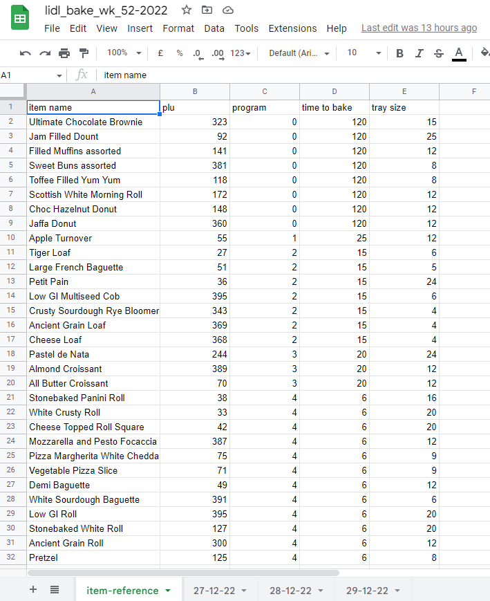

Bake plan for 28-12-22

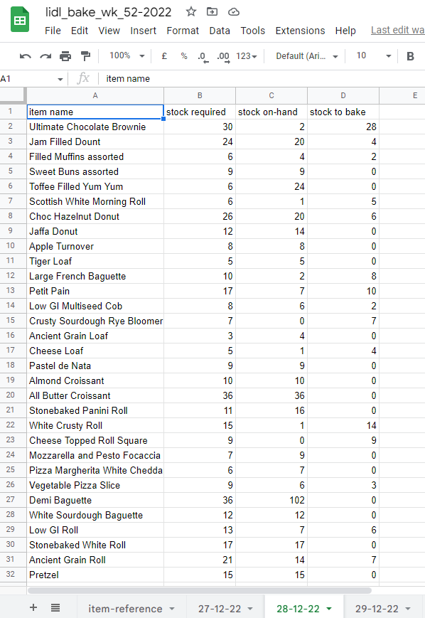

It is important to note that the naming conventions in the worksheets are
 followed, as the API relies on worksheet data to function. This is reflected in
 elements such as worksheet title, cell formatting and insertion of the newest
 sheet last in the overall spreadsheet.

The item reference sheet contains data on each individual bakery line for the
 program to address. Data such as the item name and bakery program is integral
 to the program flow.

Each day's bake plan has its own worksheet for the program to reference. This
 allows it to provide the correct plan to perform calculations against the
 user's input.

The spreadsheet holds the data for past day's entries, as shown for dates 27 and
 28-12-22. In the program scenario, the user is inputting data to calculate
 the lines they need to bake on 29-12-22. After the user confirms their inputs
 are correct, the API updates this worksheet. On the next day of trade, the
 user would be working with data for 30-12-22 in a real-world deployment and the
 29-12-22 figures would be complete and serve as a past record.

---

## Planning

Inception of the program involved jotting down on paper the steps of the main
 function.

1. Take input from the user for bake lines on-hand
2. Subtract these values from the stock required list
3. Output these results:
   - To API sheet
   - In terminal format

It also became clear that the date must be captured, so the program can address
 the correct figures for the particular day of business. This is common in
 date-sensitive ACD applications:

ACD date entry

When all the parts were in place, I jotted down a paper flow chart consisting of
 the functions I would need to code. As each function was operational, I checked
 it off the list and moved to the next one.

As testing developed, it became clear that several additional functions would
 need to be implemented to fully realize the project goals. These will be
 explored in the features section in detail.

### UX

First and foremost, this program is designed for daily use in a fast-paced,
 customer-centric industry. The application must perform its required function
 efficiently and without friction for the user.

Program flow is clear. The user is guided through the process in polite yet
 assertive manner. All actions are confirmed and no action is taken without
 the user being sure of their choice. All instances of program function are
 clearly delineated and the user should never be confused about what is
 happening at any given moment.

### User Stories

Two parties are referenced in the following user stories:

- The 'Client' - Lidl GB
- The 'User' - The Lidl bakery co-ordinator member of staff

Client goals:

- Increase operational efficiency in daily afternoon bake task
- Aid KPIs by generating correct figures - e.g. only baking what is required
- To make the task accessible to all staff, regardless of mathematical ability
- To further aid the push to paperless working

User goals:

- To perform the daily afternoon bake task more efficiently
- To have confidence that their bake plan is correct
- To have a frictionless experience in performing their task

In the testing section, we will examine how these outcomes have been achieved.

---

## Design Process

### API Integration

Before writing any functions, the first order of business was to setup any
 dependencies and test the API for Google Sheets integration. This required 
 the libraries for gspread and google-auth.

Tests were made to confirm API function by printing vars made by gspread
 methods. [See commit f8f16c0](https://github.com/jts272/pp3-lidl-bake-mate/commit/f8f16c08f60e22d4d4479ed191d596766aec3081)

With API integration confirmed, I would proceed to code the initial versions of
 each function, with the aim of achieving the MVP detailed above in the planning
 section.

### Main Function

As my first full terminal program and Python project, my initial goal was to
 simply write the necessary functions in order to produce the ultimate result
 of providing the bake plan. As each function developed, I thought of and tested
 for any errors that may occur from either the API or user input. I would later
 refactor or even rewrite functions in the name of project goals.

For example, it became clear that creating a var for each worksheet would not be
 scalable in a real-world scenario. I had to think of different ways for the
 user and program to access the necessary worksheet.

I had experimented with using `.csv` formats with the `DictReader` library.
 Upon further reading of the gspread docs, I had found that certain actions I
 wanted to perform were available as gspread methods.

After the MVP was achieved, I looked at ways to implement exception handling and
 user confirmation. It was vital that the user could access the data they need,
 be confident in their inputs and have all interactions provide feedback. This
 was an iterative process and a great exercise in
 [defensive design](https://en.wikipedia.org/wiki/Defensive_design) thinking.

Furthermore, at each step, I would consider text formatting and how to best
 present the terminal data in a clear, pleasing manner.

Below is the main function flow chart as seen in the deployed program:

  - ![Main flow chart]

---

## Features

Here we will examine the what, why and how of each individual function.
Functions are presented here in order of operation, from program start. The
 functions detailed here are the ones that form the UX. More 'behind the scenes'
 functions are addressed in the testing section.

### Display Program Introduction

On program start, the user is presented with a text box that serves to get the
 first-time user acquainted with the program. It informs the user what the
 program does. Links are given so that the user may access the accompanying
 worksheet and this readme document.

A confirmation prompt is provided, which is a returning theme throughout the
 subsequent features. From here, the program moves to the foundational function
 from which the rest of the program's data is based upon.

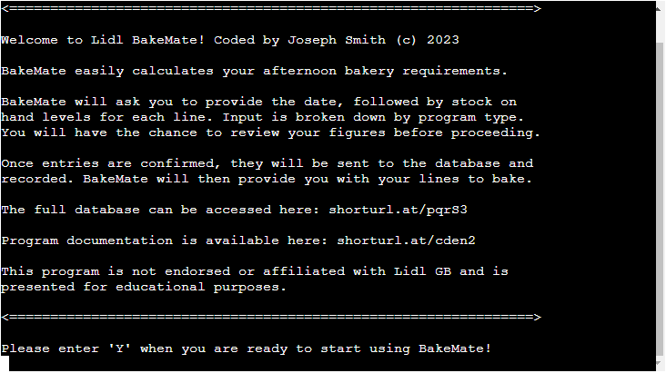

### Date Input

Much like other date-sensitive tasks, the user is first required to input the
 date:

Exceptions are handled in the event that the user submits a date that is not
 valid, or a past date that the program and database already have data for. Note
 that this does not involve Python date objects. The user is prompted to enter a
 string *in a specified date format* which correlates to how the Google Sheet is
 set up. Of further note is that user input on the ACD is numerical.

ACD date out of range

If users enter a text string, then they are notified that no data is available.
 If a past date is provided, they are notified of the most recent date
 available. Remember that this scenario spans a three-day period of time. In
 real-world deployment, the latest sheet would always give the current days'
 date as the spreadsheet would always be updated with the latest worksheet from
 the Head Office side.

On successful date input, the program proceeds to the stock entry function.

### Stock Input

The user inputs the stock on hand for a given line, in a given product group.
 Bakery products in-store are also merchandised in a manner that resembles their
 respective baking program.

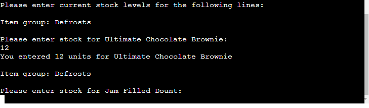

The choice was made to break the input down into sections. In this way, the user
 can confirm their entries in subsections, rather than having to submit values
 for the full list of 30+ lines before reviewing. This reflects the concept of
 [chunking](https://en.wikipedia.org/wiki/Chunking_(psychology)) in psychology.

At the end of each subsection, the user is presented with their inputs per line.
 They are given the choice to confirm that their entries are correct, by which
 they can continue to the next program's stock entries.

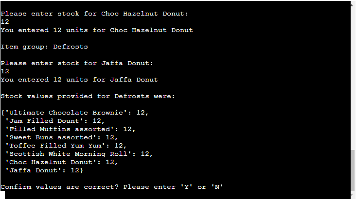

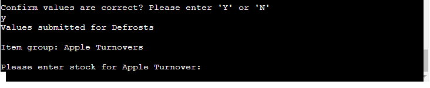

If the user selects 'N', the current subsection's input request will repeat:

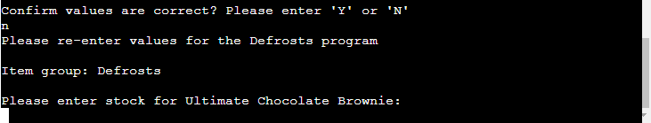

In the event that the 'Y' or 'N' input is not recognized, the program will ask
 for user input for the program again, to rule out errors defensively.

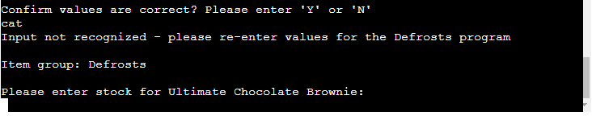

### Final Stock Confirmation

All of the user's inputs by program are presented in a final list of 'Item' :
 'Quantity'. This allows the user one last chance to check their entries before
 submission to the database. The user is informed that this will be the next
 action:

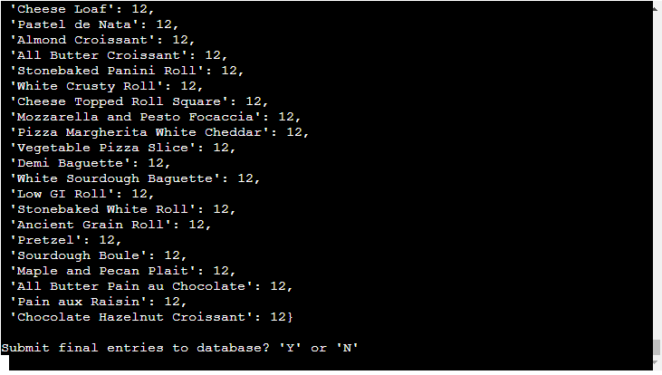

When the user confirms their values, the data submission and display final
 figures display functions will run. However, if the user selects 'N', they are
 given a clear choice to either return with their current values or restart the
 program. In this event, all user input is recollected.

### Update Worksheets

When the user confirms their complete entries, these figures are sent to the
 worksheet by the API. It is shown to the user which values are being sent and
 which worksheet is being updated.

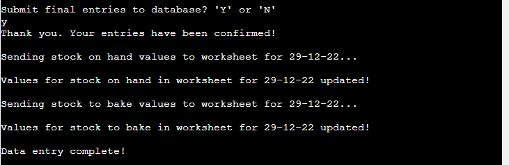

Updated worksheet

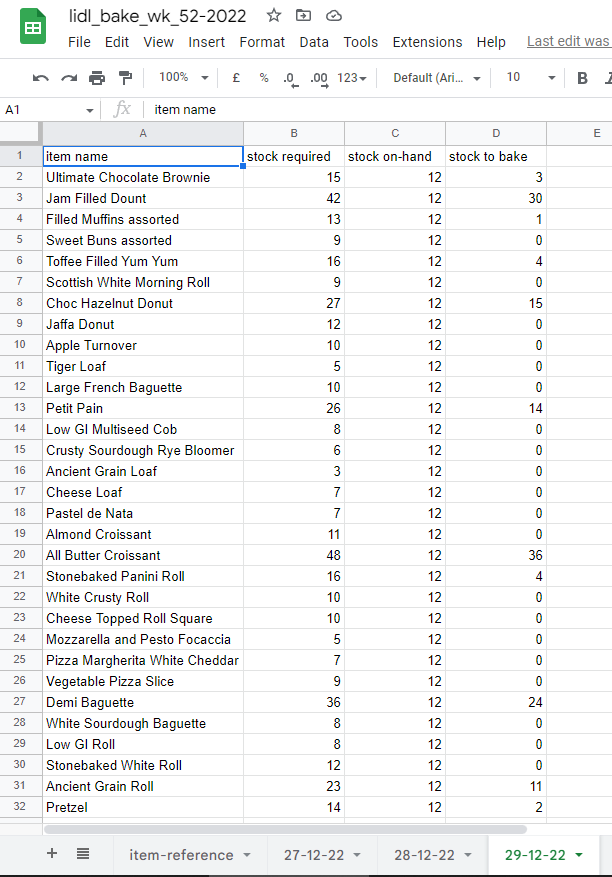

### Display Final Stock to Bake

Finally, the user is presented with the list of stock they are required to bake.
 Crucially, any lines that require 0 items to be baked are excluded from this
 list using conditional logic. This presents a clean, essential list for the
 user to continue with their next task with exactly the information they need.
 The user is thanked for their input and notified that the program has finished.

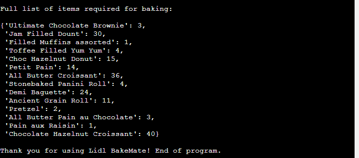

---

## Full Function Flow Charts

![Intro flow]

![Date flow]

![Input flow]

![Confirm flow]

![Update flow]

![Results flow]

---

## Testing

This section details what was tested for and the result achieved. Procedures are
shown for the program functions that were tested. After saving my code, by
 entering `python3 run.py` into the terminal, I was able to run my code within
 my IDE. This allowed me to collect instant feedback from these procedures and
 make adjustments as required.

### User Stories Testing

Each goal is addressed with an explanation of how the goal was facilitated.

Client goals:

- Increase operational efficiency in daily afternoon bake task
   :heavy_check_mark:
  - The program allows staff to complete a daily task in a logical manner, which
     produces the desired numerical result
- Aid KPIs by generating correct figures - e.g. only baking what is required
   :heavy_check_mark:
  - Human error is reduced as the program handles all arithmetic so procedures
    are followed accurately
- To make the task accessible to all staff, regardless of mathematical ability
   :heavy_check_mark:
  - The program flow is made clear so can be used with little need for training
     or mathematical ability
- To further aid the push to paperless working :heavy_check_mark:
  - The program moves a pen and paper task to the ACD and keeps electronic
     records in the spreadsheet

User goals:

- To perform the daily afternoon bake task more efficiently :heavy_check_mark:
  - The user is guided through the program, needing only to enter numbers to the
    terminal
- To have confidence that their bake plan is correct :heavy_check_mark:
  - All arithmetic is handled by the program and all input must be confirmed
- To have a frictionless experience in performing their task :heavy_check_mark:
  - The program is simple, self explanatory and has user-friendly flow

### Function Testing

All instances of inputting a single letter in menus has been programmed and
 tested to work, regardless of being upper or lower case. Text formatting was
 tested and adjusted before committing each function to GitHub. Factors tested
 included newline insertion, pretty-print behaviour and display behaviour inside
 the Heroku mock-terminal.

Common to all functions was the testing of args working as intended, and vars
 being correctly displayed to the user in print/input elements.

Functions that perform actions that the user never interacts with directly are
 marked with :see_no_evil:

#### API Functionality

- Credential setup allows access to spreadsheet :heavy_check_mark:
- gspread methods access desired sheet data :heavy_check_mark:

#### Introductory Text Function

- All necessary text is displayed within terminal bounds :heavy_check_mark:
- 'Y' key moves app forward, regardless of case :heavy_check_mark:
- Any other input requests the user to enter 'Y' to proceed :heavy_check_mark:

#### Date Input Function

- Entering most recent date in specified format moves the app forward
   :heavy_check_mark:
- Entering a date on file that is not the current date asks for input again and
  informs the user of the date needed to input :heavy_check_mark:
- Any other input notifies the user of the most recent date and to input it
   :heavy_check_mark:
- The function returns reference to the desired sheet :heavy_check_mark:

#### Get Stock Required Function :see_no_evil:

- The correct col is selected for the sheet, based on arg supplied
   :heavy_check_mark:
- Desired list is returned in the correct format :heavy_check_mark:

#### Separate Items by Program Function :see_no_evil:

- vars given global scope are accessible by other functions :heavy_check_mark:
- dict created inside function has desired values :heavy_check_mark:
- Each list comprehension created from the function contain the desired items
   :heavy_check_mark:

#### Enter Stock Values Function

- Current item group (bakery program) is shown :heavy_check_mark:
- Current item is shown and loops in correct order :heavy_check_mark:
- Entering a valid number proceeds to the next item :heavy_check_mark:
- Entering a negative number is not recorded and the user is prompted for the
   correct format :heavy_check_mark:
- Any other input is marked as invalid and the user is shown the format
   required :heavy_check_mark:
- Program summary dict is shown in insertion order, with inputted values
   :heavy_check_mark:
- 'Y' or 'N' inputs perform their function to proceed or restart the count
   :heavy_check_mark:
- Any other input on confirmation option repeats the current program count
  :heavy_check_mark:
- Input proceeds correctly by program group after confirmation, based off args
   supplied at function call :heavy_check_mark:

#### Combine Program Lists Function :see_no_evil:

- *args are combined in insertion order, to form one continuous list
   :heavy_check_mark:
- List is returned to other functions :heavy_check_mark:

#### Display Final Summary Function

- Desired results are pprinted to the terminal in the correct format
   :heavy_check_mark:

#### Confirm Full Input Summary Function

- Final input dict is shown with correct values in insertion order
   :heavy_check_mark:
- User can select 'N' to enter program reset prompt :heavy_check_mark:
- Program reset restarts the program :heavy_check_mark:
- User can always return to the previous input prompt :heavy_check_mark:
- Inputting 'Y' proceeds to next function where the results interact with the
   API :heavy_check_mark:

#### Update Worksheet Function

- The correct cells are updated with the correct data, based on function args
   :heavy_check_mark:
- The user is notified on which parts of the sheet are being updated, based on
   function args :heavy_check_mark:

#### Calculate Items to Bake Function :see_no_evil:

- args passed in work with mathematical operators such as `-` :heavy_check_mark:
- Conditional logic adjusts negative ints to '0' :heavy_check_mark:
- List is returned from function with desired values :heavy_check_mark:

#### Present Bake Requirements Function

- Function produces the correct dict using the const for all item names and the
   supplied arg :heavy_check_mark:
- dict is displayed in the correct format and order for the baker
   :heavy_check_mark:

---

## Validation and Version Control

I setup my working environment to make validation easier. First, as Python uses
 indentation in code blocks, I used a VS Code extension to highlight indentation
 levels and marks errors in red.

I made use of VS Code's 'format on save' feature to handle much of the spacing
 requirements for the code. After enabling Python linting in my IDE, I could
 catch any formatting errors as they happened any utilize any suggestions
 provided.

I made sure to familiarize myself with [PEP8](https://peps.python.org/pep-0008/)
 \- the official Python Style guide. Python is especially stringent on column
  count. I set up rulers in my IDE at cols 72, 79 and 80 so I had a visual
  reference for the bounds to keep my code and comments in.

Many inline comments were provided to give context to vars and functions. As per
 the style guide, I made no comments past col 72. I used a
 [URL Shortener](https://www.shorturl.at/) in instances where a hyperlink was
 provided that would break the line limit. These links can easily be followed in
 VS Code with `ctrl+click`.

Comments were very granular, so that others or my future self can make sense of
 the code, whilst referencing any relevant sources provided. Each function was
 provided a docstring, which functions as a large comment to give context to
 the function it is appended to. Pertinent information such as function
 requirements and parameter descriptions can be found in each docstring.

By following best practice guidelines throughout development, my code has fully
 passed through the [CI Python Linter](https://pep8ci.herokuapp.com/) with 0
 issues:

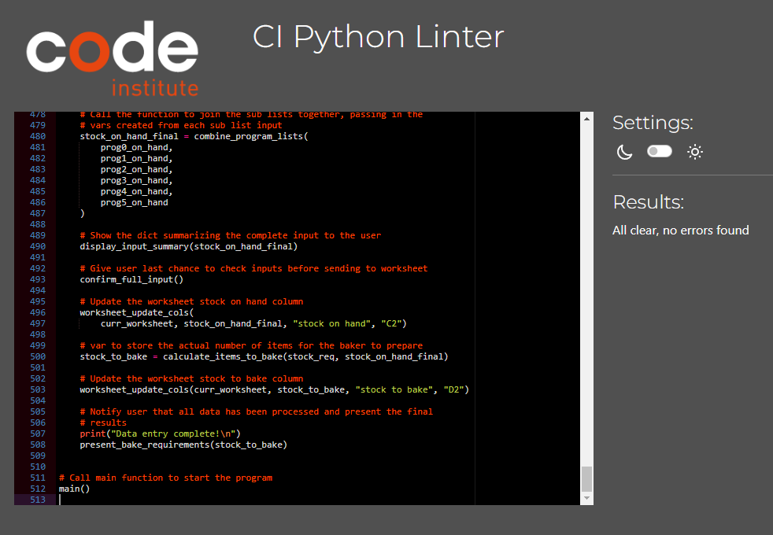

This can be verified by pasting in the content of `run.py` into the link above.

I have continued to implement the
 [Conventional Commits](https://www.conventionalcommits.org/en/v1.0.0/#summary)
 guidelines for commit messages. The commits are well defined, with additional
 comments provided to flesh out the details, such as 
 [commit 552f830](https://github.com/jts272/pp3-lidl-bake-mate/commit/552f830cff373d93179d929974c22ae41622fae5).
 GitHub users can also comment on commits. I have used this feature in
 [commit 607eb6b](https://github.com/jts272/pp3-lidl-bake-mate/commit/607eb6bdac9053b2eaf62b17b2a1e0d7bc8f57e1).
 Look out for ellipses and speech bubbles in my
 [full commit history](https://github.com/jts272/pp3-lidl-bake-mate/commits/main)

---

## Bugs

Testing was thorough during development. I would note down any bugs that occured
 during the design of each function. I would then search for ways to remedy the
 function's behaviour and test again. The final program performs its intended
 function with no obvious issues.

B = Bug

F = Fix

- B: List items being appended even if invalid:
  - F: Append inside if block

- B: Final list appending items separately instead of making one big list:
  - F: Use `.extend()` not `.append()`

- B: var only holding first sum when calculating stock to bake:
  - F: Enclose var in list brackets: `calculation = [(required - on_hand)]`

- B: Returned stock list only returning one number, not a list:
  - F: Append to new list from inside `for` loop

- B: Unable to use `<` operand between string and int:
  - F: Don't use list comprehension for different data types. Use `if` conditional check 
       before appending

- B: List keeps appending values when function is restarted:
  - F: Use `list.clear()` method in `if` statement

- B: f string too long to access `{var}`:
  - F: Use f strings on multiple lines in parentheses

- B: Unable to zip item list:
  - F: Use numpy `.concatenate()` method to flatten the list of list items into
       one list.

- B: Not displaying full results in final list of items to bake:
  - F: Check correct A1 notation argument for cells to reference in worksheet

- B: pprint shows artefacts from f strings:
  - F: Known issue - don't use f strings with pprint. Use separate, surrounding
        print statements

- B: Dictionaries displayed alphabetically when pprinted:
  - F: Use `sort_dicts=False` argument when pprinting a dict where insertion
       order is required to be retained

- B: Typing `...` at the end of an f string causes it to not display:
  - F: VS Code complained of an 'instance string'. Made new print statement on
        next line to display the text asterisk

- B: Infinite `while` loop in intro function:
  - F: Missing `()` on `user_input.lower()` so input could never be matched

### Known Issues

There is a rare instance where the 'return or restart' prompt re-appears if the
 program is completed after the user selects the restart option. This does not
 affect the function of the program or API, which manifests merely as a visual
 quirk.

---

## Project Outcome Summary

This project was built with clarity of purpose in logical steps. By considering
 the user stories, each function was designed with the user and their desired
 outcome in mind.

Inputs are handled appropriately. Errors are recognized by the program, which
 guides the user towards their next input action. The program has not been found
 to crash as a result of user input. Exception handling is implemented to cover
 all of the opportunities for user input error. In all instances, the error and
 solution is communicated to the user.

This project was data-driven and as such, 
 [OOP](https://en.wikipedia.org/wiki/Object-oriented_programming) concepts such
 as classes were not present in my solution. The program, along with the
 spreadsheet work in tandem to meet the needs of real-world business. The data
 model uses real figures which produce an accurate result for the business'
 needs.

Every effort has been made to implement efficient, well-documented code that
 leverages the power of Python. I found features such as list comprehensions 
 interesting to work with. Python's extensible nature through library imports
 was of great use in this project. I found by searching the web that there
 are many libraries and modules to 'drop-in' to Python projects to implement
 a feature - sometimes with just
 [one line of code!](https://github.com/jts272/pp3-lidl-bake-mate/commit/60305a296751876c95e20f64559c6aa4ed6080d1)

The program runs with a logical flow, in both code and UX. I utilized a `main()`
 function that would call the other functions in sequence. This was great for
 'switching functions on and off' during development and testing. As development
 progressed, I became increasingly confident with core programming concepts,
 such as arguments, loops and how data types interact.

### Design

Design of the project was considerate of its future users. At its core, it is
 a tool for working with numbers, but it is still important to elicit a positive
 emotional response from users - especially in the fast-paced work environment
 it was designed for. Commands are politely assertive, whilst always keeping the
 user in control of their data.

The program is designed in such a way that the user only performs the actions
 essential to program function. Any errors are reported and feedback is given
 every step of the way.

### Development & Implementation

Efforts have been made to follow 
 [clean coding](https://www.freecodecamp.org/news/clean-coding-for-beginners/)
 principles.
 [Refactoring a function](https://github.com/jts272/pp3-lidl-bake-mate/commit/cedb6376aed2b2862198dc5e81640944e7c1b81a)
  to help follow the
  [DRY principle](https://en.wikipedia.org/wiki/Don%27t_repeat_yourself) is one
  such example. Consistent coding style is evident, as well as no validation
  errors presenting in the final program.

By following concepts of defensive design, I ensured that the final code is
 robust, presenting no logic errors. This manifests in the validation of user
 inputs that facilitate smooth API integration. No terminal errors have been
 found in the deployed program.

### Real-World Application

In considering the real-world usage scenario at project inception, I created
 program logic that could easily be transposed to the ACD hardware. I am very
 familiar with the process the program covers. I enjoyed the challenge of taking
 an everyday work activity and dataset and finding a way to optimize that
 process.

### Security

Security must be considered due to the API functionality requiring credentials.
After generating credentials on the spreadsheet side, this sensitive data was
added to the `.gitignore` file. This means that this core project file is used
but never exposed as project files are pushed to GitHub.

---

## Deployment

Heroku was the platform chosen to host the program, for its capability for
 hosting dynamic content. My code was used alongside the
  [CI Python template](https://github.com/Code-Institute-Org/ython-essentials-template)
  to produce the 'mock-terminal' effect found on the deployed site. This allows users to interact with the code directly, much like running the `run.py` file in an IDE.

There were several steps to deploying this project, which are more involved than
 simply
 [deploying to GitHub Pages.](https://github.com/jts272/pp2-license-to-quiz#deployment-cloning--forking)
 By following these steps *in order*, you may publish a similar application to
 the web.

In `run.py` (or the name of the file(s) running the program logic):

1. Ensure any `input` elements are suffixed with a newline `\n` char.
2. Generate a list of requirements for Heroku. These are the dependencies used
   in the Gitpod VS Code workspace. To generate, ensure there is a
   `requirements.txt` file in your project root. Then enter 
   `pip3 freeze > requirements.txt` into your terminal. This will build a list
   of dependencies that Heroku will use to build the project. The file generated
   for this project looked like this:

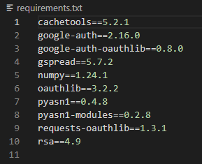

3. Ensure that these files are all saved, committed and *pushed* so that Heroku
   can use these files later.

In [Heroku](https://id.heroku.com/login):

1. Login or Sign up - you may need to activate your
 [GitHub Student Pack](https://www.heroku.com/github-students) if applicable.
2. Ensure that your account is set up correctly and your Eco Dynos plan is
   active in Heroku - contact your learning institution for more information.
3. Select 'Create new app' from your Heroku Dashboard.
4. Create a unique name for your app and select your region. Select 'Create 
    app'.

In the 'Settings' tab of the project dashboard:

1. Select 'Reveal Config Vars'. Here you will add KEY:VALUE pairs to adjust app
    behaviour. Remember that there is an untracked file in the project
    containing credentials for API function. This can be added by following
    steps 2 and 3, if required in your project.
2. In 'KEY', enter `CREDS`.
3. In 'VALUE', paste in the text content of your `CREDS.json` file. Select 'Add'
4. Repeat this process with a KEY:VALUE pair of `PORT` and `8000`. This is
    necessary regardless of your program's use of credentials.

Your results should appear like this:

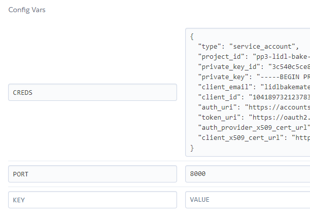

5. Select 'Add buildpack'. Add the following buildpack *in order.* These can be
    re-ordered by drag-and-drop if needed.
6. python
7. nodejs

Compare with the image below:

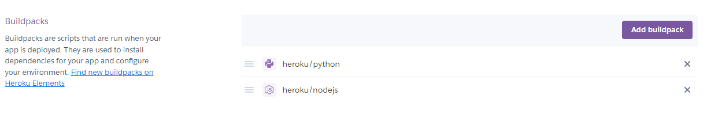

In the 'Deploy' tab of the project dashboard:

1. In 'Deployment method', select 'GitHub' and follow the prompts to connect.
    You will need to use the seach field to locate the appropriate repository.
2. When the correct repo is located, select 'Connect'.
3. Finally, select 'Deploy Branch' at the bottom of the page. A build log will
    begin running. A link will be provided to the site after this process.

The Heroku page should appear like this:

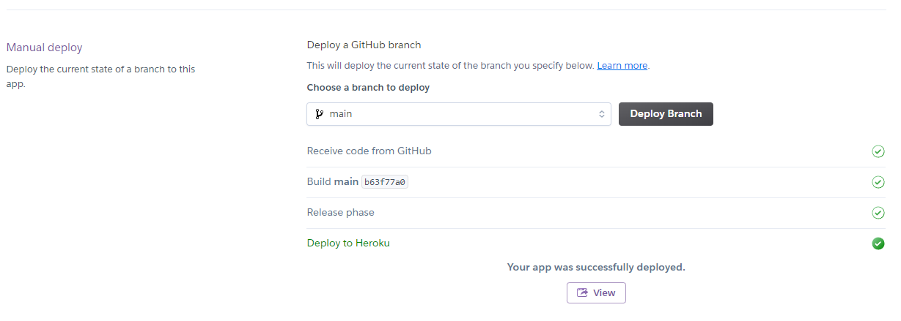

4. Select 'View' here, or 'Open app' from the project dashboard at any time.

## Cloning & Forking

Steps as in [My previous project](https://github.com/jts272/pp2-license-to-quiz)

How to Clone:

- Select the green 'Code' dropdown button
- Copy the HTTPS link to the clipboard
- Type git clone followed by the copied link in your repository terminal
- The project files will download to your working directory

How to Fork:

- Log in/Sign up to GitHub
- Select 'Fork' from the top right corner

---

## Technologies Used

[Code Institute Python Template](https://github.com/Code-Institute-Org/python-essentials-template)
\- This formed the foundation for the project, which integrated with the CI mock
terminal that the project is presented in.

IDE - VS Code in Gitpod

Google Account Services for API integration:

- Google Cloud
- Google Sheets
- Google Drive

Deployment Platform - Heroku

Python Libraries imported and installed:

- [pprint.pprint](https://docs.python.org/3/library/pprint.html) - 'Pretty-print'
  dict and list data in the terminal

- [time.sleep](https://docs.python.org/3/library/time.html?highlight=time%20sleep#time.sleep) - 
  [Add delay to a function](https://github.com/jts272/pp3-lidl-bake-mate/commit/7ae2397721fb83bd3b62760b43e5788060e40099)
  so the user can see what is happening when the program is restarted

- [gspread](https://docs.gspread.org/en/latest/) - The basis of the Google Sheets
  integration

- [google-auth.Credentials](https://google-auth.readthedocs.io/en/stable/reference/google.auth.credentials.html)
  \- For authorizing gspread scope in the Google Sheets API

- [numpy](https://numpy.org/doc/stable/index.html) - for its
  [list flattening method](https://numpy.org/doc/stable/reference/generated/numpy.concatenate.html)

---

## Credits, Future Ideas and Closing Words

All credit has been provided inline in the `run.py` file as appropriate. I would
 however especially like to draw attention to the
 [bobbyhadz blog](https://bobbyhadz.com/), which always seemed to put me in the
 right direction in an easy to follow format. I found reading Robert Greene's
 [The Daily Laws](https://www.goodreads.com/book/show/57565805-the-daily-laws)
 a great source of energy when thinking about how to bring the project to life.
 I would also like to credit my mentor Anthony Ugwu, for his multiline print
 refactor suggestion. He also helped in thinking about how to break functions
 down to even smaller parts to aid testing and function in future projects.

I had considered a secondary function to make, using OOP, to provide information 
 to the user on the properties of all bakery items. This would include further
 information such as PLU (product look up) code and baking time. This would
 allow the staff member to have a reference guide to learn more about the
 products. Alternatively, a var could be inserted to show the PLU alongside the
 item in question when getting user input. The user would learn by repetition of
 seeing the number next to the associated item each time they complete the
 program. This data can easily be pulled from the spreadsheet, which has a
 dedicated item reference sheet that is already in use. This would allow the
 data to be dynamically updated 'from the other side'. Imagine an item PLU code
 being changed. The program would still reference the relevant sheet  cell -
 only the content will have changed.

 Overall, I decided that working with a familiar process and dataset would
 provide a great environment for me to get comfortable with pure Python
 programming. I enjoyed the challenge of thinking through the problems and
 designing solutions. I intend to take these concepts with me as I return to
 working with JavaScript or any future programming languages.